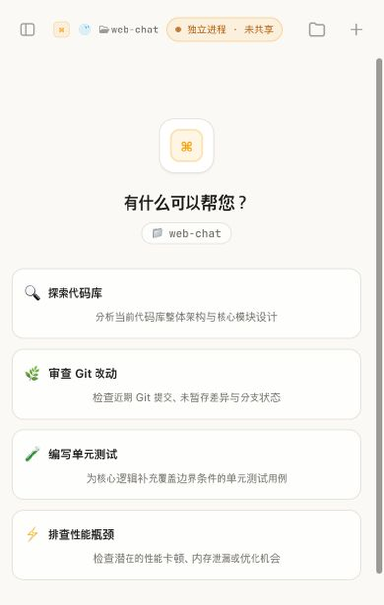

<div align="center">

# pi-web-chat

**在浏览器与手机上，统一使用 pi 和 Codex。**

移动优先的 Coding Agent Web 工作台：原生会话、实时工具、项目文件与 Git、断线恢复，以及 Token + 2FA 安全访问。

<p>
  <a href="https://github.com/Ryn-Mic/pi-web-chat/actions/workflows/ci.yml"></a>
  <a href="https://github.com/Ryn-Mic/pi-web-chat/releases"></a>
  = 20" src="https://img.shields.io/badge/Node.js-%E2%89%A520-339933?style=flat-square&logo=node.js&logoColor=white">
  <a href="./LICENSE"></a>
</p>

<p>
  <a href="#快速开始">快速开始</a> ·
  <a href="#pi--codex如何协作">pi + Codex</a> ·
  <a href="#功能一览">功能一览</a> ·
  <a href="#安全与远程访问">安全访问</a> ·
  <a href="#开发与发布">开发与发布</a>
</p>

</div>

<p align="center">
  
  <br>
  <sub>本地 <code>127.0.0.1:3141</code> · 390 px 移动端视口 · Codex 新会话</sub>
</p>

## 它是什么

pi-web-chat 最初是 [pi](https://pi.dev) 的 Web 扩展。现在，它在保留原有安装和启动入口的同时，加入了原生 Codex `app-server` 集成：一个 Web 服务即可创建、恢复和控制两类 Agent 会话。

> [!IMPORTANT]
> 当前版本仍通过 `pi install` 安装、通过 `pi --web` 启动，默认新会话也仍使用 **pi**。Codex 是已经集成到同一 Web 工作台中的可选后端；本项目目前不是独立的 Codex 启动器。

启动后，你可以在网页设置中为**新会话**选择 pi 或 Codex。已有会话保留各自的后端，pi 与 Codex 标签页可以同时在线、独立运行和恢复。

## 核心亮点

<table>
  <tr>
    <td width="50%" valign="top">
      <strong>◈ 一个入口，双 Agent</strong><br>
      同一个 <code>pi --web</code> daemon 同时承载 pi SDK 会话与 Codex 原生线程；新会话按需选择，现有会话互不串线。
    </td>
    <td width="50%" valign="top">
      <strong>⌘ 原生 Codex 体验</strong><br>
      直接连接 Codex <code>app-server</code>，保留原生线程（thread）、模型与推理档位、工具进度、上下文用量、审批、提问和 MCP 表单。
    </td>
  </tr>
  <tr>
    <td width="50%" valign="top">
      <strong>▣ 真正面向移动端</strong><br>
      PWA、动态视口、iOS 安全区、触控友好的会话与文件抽屉、全屏预览，以及图片选择和粘贴。
    </td>
    <td width="50%" valign="top">
      <strong>⌁ 项目上下文触手可及</strong><br>
      文件树、搜索、<code>@文件</code> 引用、安全预览，以及 Git 状态、分支、提交与 diff，都在会话旁完成。
    </td>
  </tr>
  <tr>
    <td width="50%" valign="top">
      <strong>↻ 为长会话与弱网而生</strong><br>
      活动分支分页、增量快照、缺失事件补拉与 WebSocket 退避重连；每个标签保留独立连接、草稿和工作区。
    </td>
    <td width="50%" valign="top">
      <strong>◇ 默认带安全边界</strong><br>
      默认仅监听 <code>127.0.0.1</code>；聊天、会话、文件、Git 等业务 API 与 WebSocket 需要登录，文件访问限制在 Web Chat 已识别的项目根目录内。
    </td>
  </tr>
</table>

## 快速开始

### 1. 安装 pi 与 pi-web-chat

需要 Node.js 20 或更高版本。

```bash
# 安装 pi；已经安装可跳过
npm i -g @earendil-works/pi-coding-agent

# 安装最新稳定版
pi install npm:@ryn-mic/web-chat

# 或安装当前 GitHub Release
pi install git:github.com/Ryn-Mic/pi-web-chat@v0.1.108
```

npm 包名是 `@ryn-mic/web-chat`；产品名与本地命令仍为 `pi-web-chat`，启动方式仍是 `pi --web`。

### 2. 启动 Web 服务

```bash
pi --web
# pi-web-chat started — http://127.0.0.1:3141
```

`pi --web` 只启动后台 Web daemon，不会打开 pi TUI，并会立即把终端控制权交还给你。如果服务已经运行，它会再次打印访问地址。

### 3. 可选：启用 Codex 会话

先确保本机 `codex` 命令可用并已完成 `codex login`，然后：

1. 仍然运行 `pi --web`，无需更换启动命令；
2. 打开网页左侧会话抽屉，进入「设置」；
3. 将「新会话使用的 Agent」切换为 **Codex**；
4. 新建会话。已有 pi 会话不会被转换或中断。

## pi + Codex：如何协作

| 项目 | pi | Codex |
|---|---|---|
| 是否默认 | 是 | 否，按需选择 |
| 启动入口 | `pi --web` | 仍由同一个 `pi --web` 服务承载 |
| 本机准备 | 配置 pi 的模型与认证 | 安装 Codex 并执行 `codex login` |
| 会话标识 | pi session / JSONL | 原生 Codex `threadId` |
| Web 能力 | 流式消息、工具、模型、思考档位、运行中追加指令（steering）、中止 | 流式轮次、工具与计划、模型与推理档位、运行中追加指令、中止、审批、用户问题、MCP 表单 |

Codex 传输默认为 `auto`：优先连接已运行的共享 Codex daemon，不可用时安全回退到 standalone 原生 `app-server`。

| 传输模式 | 行为 | 适用场景 |
|---|---|---|
| `auto` | 优先共享 daemon，失败时回退 standalone | 默认推荐 |
| `proxy` | 要求共享 daemon 可用，否则失败 | 发现、观察并在释放后接续 Remote Control / Desktop / CLI 的线程 |
| `standalone` | 使用原生持久化线程，但不能共享另一客户端内存中的进行中 turn | 只在 Web Chat 内使用 Codex |

如需让 Web Chat 发现、观察并接续同一批 Codex 线程，请先执行：

```bash
codex remote-control start
pi --web
```

> Codex 线程遵循单写者约束：当另一客户端正在占用线程时，Web Chat 会以只读 observer 观察；占用释放后再自动升级并接续。`standalone` 描述的是传输连接方式，不代表每个会话都会单独启动一个操作系统进程；会话仍由原生 `threadId` 隔离。

## 功能一览

- **流式对话**：文本与思考过程增量、Streamdown Markdown、Shiki 代码高亮、工具调用与可展开结果。
- **多会话工作台**：会话列表、独立标签、每会话 URL（`/s/:sessionId`）、后台持续运行；连接同一个 pi-web-chat 服务并打开同一会话 URL 时可跨设备实时同步。
- **可靠恢复**：长历史分页、活动分支同步、增量快照、断线重连与缺失事件补拉。
- **完整交互**：发送、运行中追加指令（steering）、中止、模型选择、思考强度、图片附件、用户消息复制与重新填入。
- **Codex 原生闭环**：命令、文件和权限审批，用户问题、MCP 信息征询表单、计划与上下文用量。
- **项目文件**：目录树、受限搜索、`@` 引用、文本/图片/PDF/Office/媒体等安全预览。
- **Git 工作区**：状态、分支、提交历史、diff 查看；工作区干净时可切换本地分支。
- **个性化**：系统/浅色/深色主题、pi/Codex 独立状态动效、自定义模型与供应商。
- **PWA**：可安装到桌面或手机，带自动更新提示；API 与 WebSocket 不做离线缓存。

## 常用命令

```bash
pi --web status              # 查看 daemon 状态
pi --web stop                # 停止服务
pi --web 3141 restart        # 明确使用生产端口重启
pi --web 3200                # 使用自定义端口
pi --web --lan               # 监听 0.0.0.0，允许局域网访问
pi --web --host 0.0.0.0      # 显式指定监听地址
pi --web --token my-secret   # 指定访问令牌
pi --web rftoken             # 立即轮换访问令牌
```

也可以在 pi 会话中使用扩展命令：

```text
/web
/web 3200
/web --lan
/web status
/web stop
/web restart
```

daemon 状态文件位于 `~/.pi/web-chat/`：

- `pi-web-chat.pid`
- `pi-web-chat.port`
- `pi-web-chat.host`
- `pi-web-chat.log`

## 安全与远程访问

首次启动时，服务会自动生成并持久化：

- 访问令牌：`~/.pi/web-chat/token`
- TOTP 密钥：`~/.pi/web-chat/2fa.secret`（默认启用）

登录页会提供首次 TOTP 绑定二维码。除健康检查与认证入口外，聊天、会话、文件、Git 等业务 API 与 WebSocket 都需要登录；移动端预览使用短期 capability，文件与 Git 路由仅允许访问 Web Chat 已识别的项目根目录。

> [!WARNING]
> 应用自身不负责 TLS。局域网以外访问时，请使用 Caddy、nginx、Tailscale Serve 等可信反向代理或隧道终止 HTTPS。不要在公网明文 HTTP 上传输令牌或 TOTP 验证码。

<details>
<summary><strong>环境变量</strong></summary>

| 变量 | 默认值 | 说明 |
|---|---|---|
| `PORT` | `3141` | 服务端口 |
| `HOST` | `127.0.0.1` | 监听地址；仅在可信网络使用 `0.0.0.0` |
| `PI_WEB_TOKEN` | 自动生成 | 访问令牌 |
| `PI_WEB_2FA` | 开启 | 设为 `off` 可关闭 TOTP 第二因素 |
| `PI_WEB_CWD` | `~/.pi/web-chat` | 新会话默认工作目录 |
| `PI_WEB_AGENT` | `pi` | 新会话默认 Agent：`pi` 或 `codex` |
| `PI_WEB_CODEX_BIN` | `codex` | Codex 可执行文件路径 |
| `PI_WEB_CODEX_MODEL` | 未设置 | 可选的默认 Codex 模型 ID；未设置时从原生 `model/list` 读取 |
| `PI_WEB_CODEX_TRANSPORT` | `auto` | `auto`、`proxy` 或 `standalone` |
| `PI_WEB_CODEX_SANDBOX` | `workspace-write` | `workspace-write`、`read-only` 或 `danger-full-access` |
| `PI_WEB_CODEX_APPROVAL` | `on-request` | `on-request`、`untrusted` 或 `never` |

Pi 模型认证沿用 `~/.pi/agent/auth.json`；请先在 pi CLI 中完成登录或 API Key 配置。Codex 认证由本机 Codex CLI 管理。

</details>

## 开发与发布

```bash
npm install
npm run typecheck
npm test
npm run build
npm run pack:check
npm pack --dry-run
```

开发模式默认使用服务端 `3141` 与 Vite `5173`：

```bash
npm run dev
```

> 如果受保护的本地生产服务已占用 `3141`，不要同时运行默认 `npm run dev`；请先停止生产服务，或为调试服务选择其他端口。

生产构建产物为 `dist/index.js` 与 `dist/public/`，均由 `npm run build` 生成，请勿直接编辑。

### GitHub Actions Release

Release 工作流可以由 `v*` tag 自动触发，也可以在 **Actions → Release → Run workflow** 中输入一个已经存在的 `tag` 手动重跑。流程会：

1. 校验 tag 与 `package.json` 版本一致，且该提交已包含在 `main`；
2. 执行安装、类型检查、测试、构建与打包检查；
3. 将 npm tarball 与 SHA-256 校验文件发布到 GitHub Release；
4. 检测 GitHub Actions Secret `NPM_TOKEN` 是否已配置：已配置时尝试发布到 npm；未配置时跳过 npm，仅保留 GitHub Release。

如果相同 npm 版本已经存在，工作流也会安全跳过重复发布。

<details>
<summary><strong>技术栈与目录</strong></summary>

- **Server**：Node.js、pi SDK、Codex app-server、WebSocket
- **Web**：React 19、TanStack Router / Query、Base UI、Tailwind CSS v4、Vite、PWA

```text
bin/pi-web-chat.mjs        CLI 入口
extensions/pi-web-chat.ts  pi 扩展入口：--web 与 /web
server/                    HTTP、WebSocket、Pi/Codex 会话、文件与 Git 服务
shared/                    服务端与客户端协议、增量快照
src/                       React 前端
scripts/build.mjs          Vite 前端与 esbuild 服务端打包
dist/index.js              生成的服务端产物
dist/public/               生成的前端产物
```

</details>

## 致谢与许可

本项目从 [preinpost/pi-web-chat](https://github.com/preinpost/pi-web-chat) 演进而来，并在其 pi Web 扩展基础上加入 Codex 原生集成、多会话工作台、安全认证、文件与 Git 能力等持续改进。

项目基于 [MIT License](./LICENSE) 开源。
